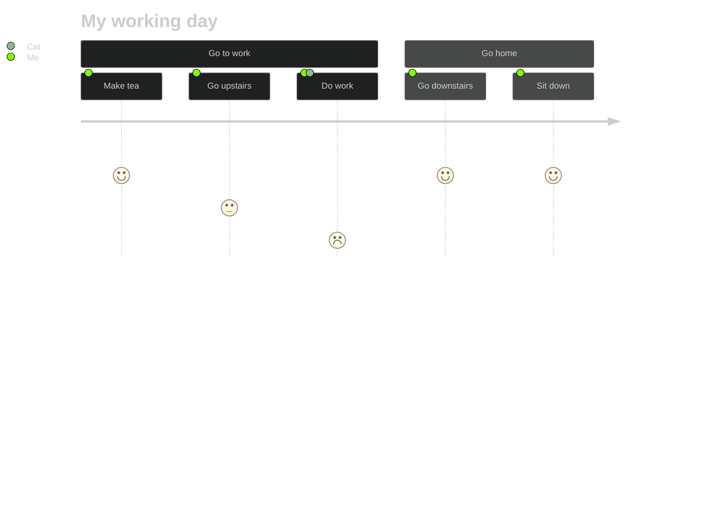

---
tags:
  - 🔴-academic/📚-educational-resources/discipline/computer-science/programming-language/python
  - 🔴-academic/📚-educational-resources/discipline/computer-science/programming-language/sql
  - data-garage/project-1
cards-deck: Default::Computer Science
version: v0.1
created: 2023-10-07 15:19
updated: 2024-01-25T16:46
---
# Project “AutodidactPlanner”

## Design Thinking Process

### Flowchart

### Stanford Idea
![[the-vault/assets/images/dschool-processhexdiagram-tool-behaviors-final-2019.png|550]]

## I. Goal

>[!info]- What are we trying to achieve overall?
>In this section, type a general description of the project. Don't worry if this goal will be modified in the future, for now simply define a direction to head towards to. In simple terms, what does this project do?

Create a comprehensive client side application that can update my Calibre database, Excel sheet, etc.

## II. User Story

## III. Define

>[!info]- What are the limitations and more specific goals of our project? What tools can we use?
>In this section, type out the criteria and constraints of the project. After that, specify what programming languages, tools, libraries, etc. you will need to complete the project. Remember, this is *not* final.

### 2.1. Criteria & Constraints

#### Criteria
- [ ] Feature that allows to scrape PDFs download to the Educational Resources folder.
	- [ ] 1. Uploads PDF to calibredb
- [ ] For now make it a simple CLI app.

#### Constraints

- [ ] Should start off with using Python
- [ ] Should start off with learning SQL
- [ ] Should incorporate ChatGPT and Bing for learning

### 2.2. Programming languages, tools, libraries, etc. 

Needed
- [ ] Python
- [ ] SQL
- [ ] 

## III. Create project folder

## IV. Notes

