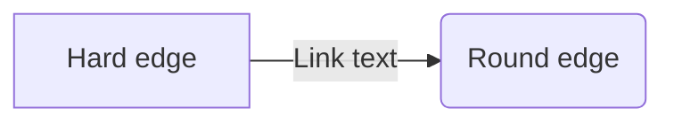

---
tags:
  - 🔴-academic/📚-educational-resource/discipline/computer-science/programming-language/python
  - 🔴-academic/📚-educational-resource/discipline/computer-science/programming-language/sql
  - data-garage/project-1
cards-deck: Default::Computer Science
created: 2023-09-02 09:11
updated: 2023-09-02 15:28
---

# Data Garage꞉ Project #1

## Design Thinking Process

###  Flowchart

### Stanford Idea
![[Pasted image 20230215024347.png]]

## I. Goal

>[!info]+
>In this section, type out the general goal of the project. Don't worry if this goal will be modified in the future, for now simply define a direction to head towards to.

![[assets/excalidraw/data-garage-project-1-criteria]]

## II. Define

>[!info]+
>In this section, type out the criteria and constraints of the project. After that, specify what programming languages, tools, libraries, etc. you will need to complete the project. Remember, this is *not* final.

### 2.1. Criteria & Constraints

| Criteria                                                                                                                                                                                                                                                      | Constraints                  |
|---------------------------------------------------------------------------------------------------------------------------------------------------------------------------------------------------------------------------------------------------------------|------------------------------|
| • Must at least, use the following programming languages: Python and SQL • Must clean and normalize the data scraped from Yellow Pages • Must define a data model for our data via the Kimball Star Method • Must upload this data to a AWS Database | • Make the project optimized |

### 2.2. T

## III. Create either git repository or

## IV. Notes

